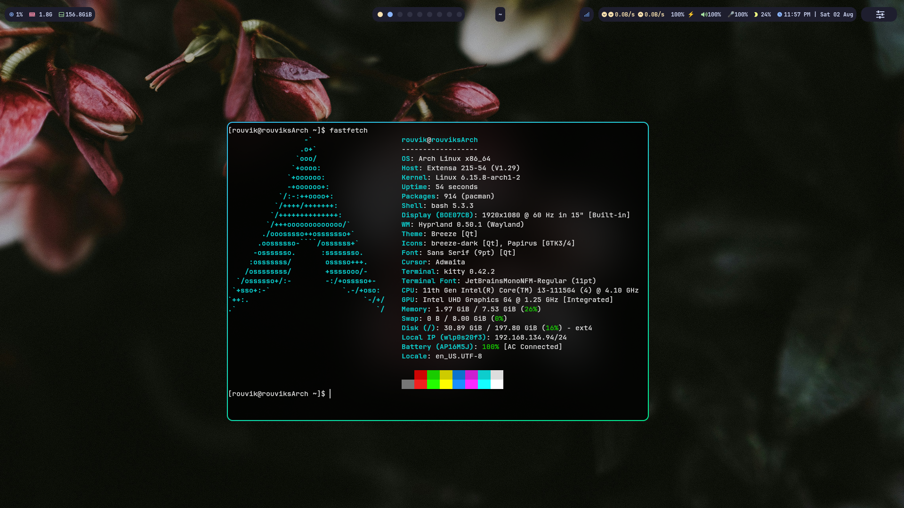

# Hey there, I am Rouvik Maji! 👋
Aspiring Software Engineer | Low Level Programmer | OS & Emulator Enthusiast

I love exploring the intersection of low-level systems, computer architecture, and software engineering. From building custom operating systems and emulators to diving into compilers, networking, and reverse engineering — I'm always up for a challenge that pushes me closer to the metal.

~ "Code is the closest thing we have to magic." ✨

# Socials:

# About me:
Hi, I'm Rouvik Maji — a passionate student and aspiring software engineer who loves building things from scratch and diving deep into how systems work.

I explore a wide range of technologies and languages including JavaScript, Node.js, HTML/CSS, Java, C++, and more. While I started with web development, my interests have grown into areas like systems programming, OS development, emulators, and low-level architecture.

I prefer working on a few meaningful projects at a time, often experimenting and learning as I go. Whether it’s crafting a web app with Node.js or writing a kernel in Assembly, I’m always excited to learn something new and push my limits.

🛠 Always building. Always learning.

# Portfolio Page:

Click to visit ⬆️

# Toolbox:
## Web - Frontend:
 

## Web - Backend:
 

## Native:
 

## Extras:
 

## Competitive Programming spaces:

# Current System specs:

# Stats:

